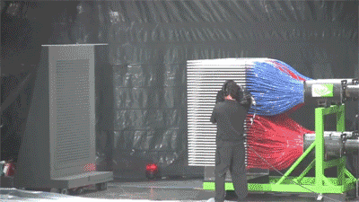

# PicturePaintball

    Watch a picture be drawn as if with paintballs
     
    

## Uploading a picture

Just uploading any image will start 'shooting paintballs' at a canvas, so you can just sit back and watch it happen!

## Check it out
Live [on this repository's site](https://luisboto.github.io/PicturePaintball/).
